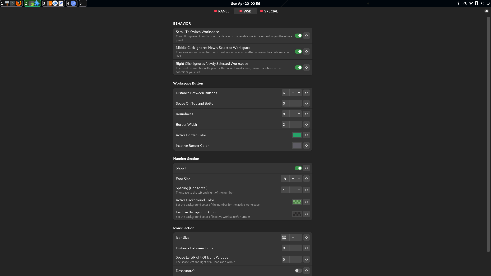

# Workspace Buttons With App Icons

Removes the original workspaces (activities) indicator and replaces it with buttons. Within each button are the icons of the windows opened in that workspace. It also moves the clock to the right to free up space if needed.

## Features

- **App Icons Ordering**
  - App icons are ordered based on most recently used (same order as the Alt+Tab switch window menu).
  - Note: When you first enable the extension and you already have windows opened, the order may not reflect this because it won't know the order yet. Once you start switching between them, it will arrange them properly.

- **Efficiency**
  - Instead of constantly recalculating everything, this extension exclusively detects small changes (window opened, closed, moved etc.) one at a time, and updates only the affected sub-part of the UI. This avoids unnecessary computation and boosts performance significantly.

- **Scroll (anywhere within the container):**
  - Switch workspace (up = left / down = right).
  
- **Middle Click:**
  - Open overview for that workspace.

- **Left Click:**
  - Switch to whichever workspace was clicked.

- **Right Click:**
  - Opens the Alt+Tab window switcher popup for that workspace (switches to it first if not active).
  - Ways to navigate:
    - **Mouse Only:**
      - Double right-click to switch back and forth between the two most recent apps (same as pressing Alt+Tab repeatedly).
      - Scroll to select the window you want, followed by a click anywhere on the screen (outside of the popup) to switch to the last selected app.
      - Click the window you want to select inside of the popup.
    - **Keyboard Only:**
      - Use left and right arrow keys or the regular Alt+Tab/Alt+Shift+Tab keys (Enter or Escape to exit).
